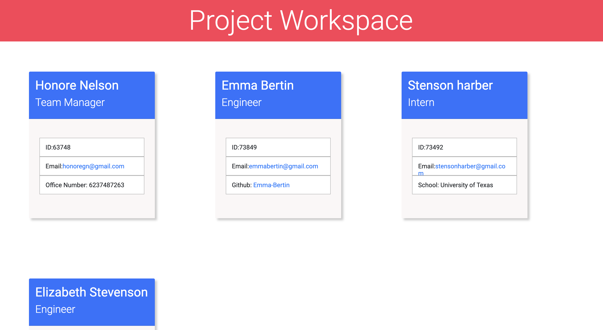
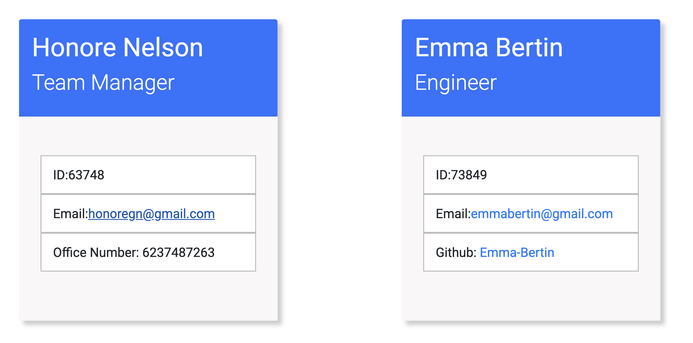

# Team Profile Generator 
[](https://opensource.org/licenses/MIT)
#### **Name:** Honore Nelson
#### **Github Repo:** https://github.com/matisses-goldfish/Team-Profile-Generator
#### **URL:** Backend Application- no URL
---
    
##  Table of Contents:
* [Description](#description)
* [Acceptance Criteria](#acceptance-criteria-reference)
* [Demo](#demo)
* [Application](#application)
* [Installation](#installation)
* [Technologies Used](#technologies-used)
* [Usage Information](#usage)
* [Testing Instructions](#testing)
* [Sources](#sources)
* [Authors](#authors)
* [License](#license)
* [Question](#questions)


## Description:
---
This node application will allow a user to enter prompt-based questions through the command line to create a customized html and css document that holds information regarding their team. This includes name, email address, phone number, university information, Github usernames, role, and employee ID. This application utilizes modularization (dist, lib and src) and inquirer!
A

## Acceptance Criteria (reference):
---
```md
GIVEN a command-line application that accepts user input
WHEN I am prompted for my team members and their information
THEN an HTML file is generated that displays a nicely formatted team roster based on user input
WHEN I click on an email address in the HTML
THEN my default email program opens and populates the TO field of the email with the address -->
WHEN I click on the GitHub username
THEN that GitHub profile opens in a new tab
WHEN I start the application
THEN I am prompted to enter the team manager’s name, employee ID, email address, and office number -->
WHEN I enter the team manager’s name, employee ID, email address, and office number
THEN I am presented with a menu with the option to add an engineer or an intern or to finish building my team
WHEN I select the engineer option
THEN I am prompted to enter the engineer’s name, ID, email, and GitHub username, and I am taken back to the menu
WHEN I select the intern option
THEN I am prompted to enter the intern’s name, ID, email, and school, and I am taken back to the menu
WHEN I decide to finish building my team
THEN I exit the application, and the HTML is generated
```

## Demo:
---
***code has been recently updated with differnt prompt format***
#### Click on the Image to begin the demo video
[](https://www.youtube.com/embed/C5WaazSPVnE)

## Application:
---



## Installation:
---
    node index.js
    
## Technologies Used:
---
* inquirer
* jest


## Usage
---
Creating a forked copy, open your repo in vs code, open your integrated terminal, then type 
    npm i
to install inquirer, and 
    node index.js 
to launch the application.
   
## Contribution Guidelines:
---
Contribute using the Github workflow model
    
## Sources:
---
* writefile formated after: https://github.com/nicolewallace09/team-profile-generator/blob/master/index.js
* Tests formated after: https://github.com/JamesLJenks/10_OOP-Team-Profile-Generator
* Switch Case formated after: https://github.com/amandardz/Team-Profile-Generator
   
## Authors
---
* **Honore Nelson** - *Initial work* - [Team Profile Generator](https://github.com/matisses-goldfish/Team-Profile-Generator)
    
## License
---
MIT
This project is licensed under the MIT License - see the [LICENSE.md](LICENSE.md) file for details
<br></br>

## Question
---
Any additional question? 
### Contact me at:
* Gmail: honoregn@gmail.com
* Github: matisses-goldfish

